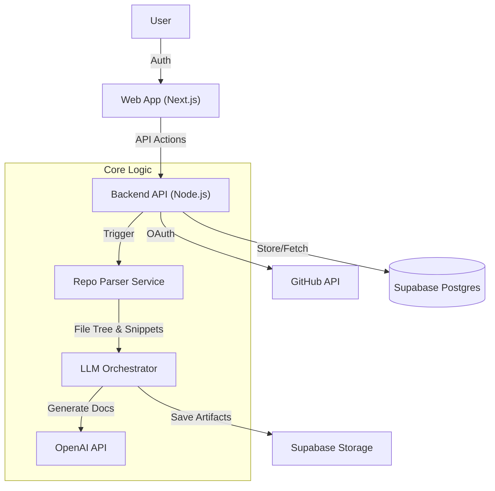

# AI Architecture Assistant

<div align="center">
  
[](https://www.typescriptlang.org/)
[](https://reactjs.org/)
[](https://supabase.com)
[]()

  </div>
  
**Automated technical documentation and task planning for modern engineering teams.**

The AI Architecture Assistant is a developer-tooling SaaS that connects to GitHub repositories, parses the Abstract Syntax Tree (AST) of the codebase, and uses Large Language Models (LLMs) to generate accurate, always-up-to-date `architecture.md` and actionable `task.md` plans.

---

## Why this exists
Development teams waste significant hours manually documenting codebase changes and scoping tasks. This tool solves the **"Documentation Drift"** problem by:
1.  **Ingesting** live code from GitHub.
2.  **Generating** high-level architectural snapshots.
3.  **converting** natural language feature requests into granular, file-specific engineering tasks.

---

## Key Engineering Features

### Context-Aware LLM Pipeline
Instead of blindly feeding code to an LLM, this system uses a custom **RAG-lite approach**:
* **RepoParserService:** Normalizes file trees and detects languages/frameworks to build a "map" of the repository.
* **Token Optimization:** Intelligently selects only relevant file snippets (e.g., `schema.prisma`, `package.json`, key controllers) to maximize context window efficiency while reducing hallucination risk.
* **Structured Output:** Enforces strict Markdown schemas for `architecture.md` (identifying Service Layers, DB Models, and State Management).

### Secure & Event-Driven Architecture
* **GitHub OAuth:** Secure authentication flow storing installation IDs via Supabase.
* **Snapshot Versioning:** Stores historical architecture states to track project evolution over time.
* **Monorepo Structure:** Built with **Turborepo** separating the Next.js frontend (`apps/web`) from the Node.js/Express backend (`apps/api`) and shared logic (`packages/common`).

---

## Tech Stack

| Domain | Technology |
| :--- | :--- |
| **Frontend** | React (Next.js), TailwindCSS, shadcn/ui |
| **Backend** | Node.js, TypeScript, Express |
| **Database** | Supabase (PostgreSQL, Auth) |
| **AI** | OpenAI API (GPT-4o), Custom Prompt Engineering |
| **Infra** | Vercel (Frontend), Supabase Edge/Render (Backend) |

---

## Architecture



---

## 📂 Project Structure

```bash
/apps
  /web         # Next.js frontend (Dashboard, Repo Onboarding)
  /api         # Node.js backend (Webhooks, Parser, LLM Service)
/packages
  /common      # Shared types (Zod schemas), Utilities
  /llm         # Prompt templates and context logic
```

---

## Getting Started

### Prerequisites
* Node.js 18+
* pnpm
* Supabase Project & OpenAI API Key

### Installation

1.  **Clone the repository**
    ```bash
    git clone [https://github.com/yourusername/ai-architecture-assistant.git](https://github.com/yourusername/ai-architecture-assistant.git)
    cd ai-architecture-assistant
    ```

2.  **Install dependencies**
    ```bash
    pnpm install
    ```

3.  **Environment Setup**
    Create a `.env` file in `apps/api` and `apps/web` based on `.env.example`.
    ```bash
    # Required keys
    DATABASE_URL=...
    OPENAI_API_KEY=...
    GITHUB_CLIENT_ID=...
    ```

4.  **Run Development Server**
    ```bash
    pnpm turbo dev
    ```

---

## 🗺 Roadmap

- [x] GitHub OAuth Integration
- [x] Basic File Tree Parsing
- [x] `architecture.md` Generation
- [ ] Drift Detection (Compare current repo vs. last snapshot)
- [ ] `task.md` Generation for Feature Requests
- [ ] Stripe Billing Integration

---

## 🤝 Contributing

This project is currently in **Alpha**. Suggestions and PRs are welcome!
