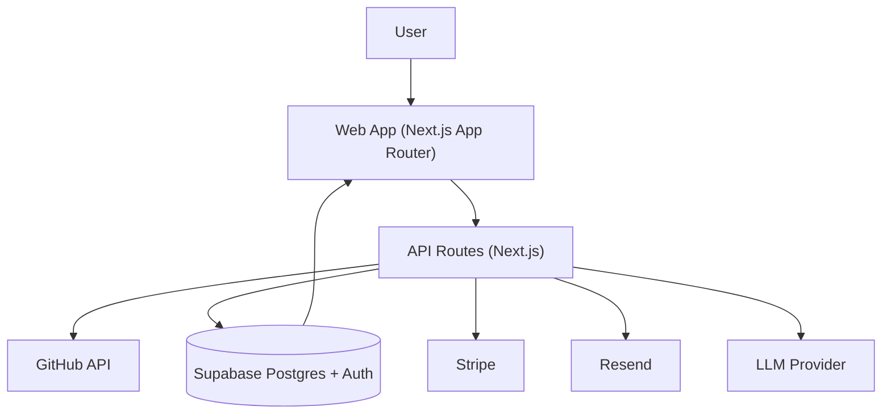

# Blueprintly

[TypeScript](https://www.typescriptlang.org/)
[Next.js](https://nextjs.org/)
[Supabase](https://supabase.com)
[Status]()

**Generate architecture docs and implementation tasks from your codebase — in minutes, not meetings.**

Archassistant is a developer-tooling SaaS that connects to a GitHub repository and produces:

- **Architecture snapshots** (a clean `architecture.md` style document for the current state of the system)
- **Implementation tasks** (a task breakdown you can execute, based on a feature description)
- **Drift detection** (see when the repo diverges from the latest snapshot)

---

## What you get

- **Connect a GitHub repo**: authenticate via GitHub OAuth and select a repository/branch.
- **Generate snapshots**: create a structured architecture doc for your repo and store it as a snapshot you can revisit.
- **Drift detection**: compare your current repository state vs the latest snapshot and visualize changes.
- **Generate implementation tasks**: describe what you want to build; get a practical breakdown and jump straight into work.
- **Export + sharing**:
  - **PDF export** (paid plans)
  - **Team collaboration**: invite members/viewers by email, accept/decline invitations, and manage project members.
- **Billing & usage**: Stripe subscriptions (Free/Pro/Team) with monthly usage tracking.

---

## How it works (high level)

```mermaid
graph TD
    User[User] --> Web["Web App (Next.js App Router)"]
    Web --> API["API Routes (Next.js)"]
    API --> GH[GitHub API]
    API --> DB[("Supabase Postgres + Auth")]
    API --> Stripe[Stripe]
    API --> Email[Resend]
    API --> LLM[LLM Provider]
    DB --> Web
```

---

## Tech stack

| Domain         | Technology                                   |
| -------------- | -------------------------------------------- |
| **Web app**    | Next.js (App Router), React, Tailwind CSS    |
| **Auth + DB**  | Supabase (PostgreSQL, Auth, RLS)             |
| **Payments**   | Stripe (Checkout, Customer Portal, Webhooks) |
| **Email**      | Resend (transactional invitations)           |
| **Analytics**  | PostHog (optional)                           |
| **Monitoring** | Sentry (optional)                            |
| **AI**         | LLM provider via API (OpenAI/Groq/etc.)      |

---

## Product status

- **Beta**: actively evolving; the UX will change as you prep for launch.
- Suggestions and PRs are welcome!

---

## Roadmap (short)

- GitHub connect + onboarding
- Architecture snapshots
- Drift detection
- Task generation
- Stripe billing + usage limits
- Team invitations + notification center
- Snapshot-to-snapshot diff (architecture markdown diff)
- Audit log + stronger admin tooling for teams

---

